# ChatInsights — MVP Architecture Diagram

> **Presentation slide:** Final verified architecture for Ascentic AI LaunchPad submission.
> Last verified: 2026-08-27 against repository `mvp-backend-core`.

---

## Architecture Diagram

```mermaid
flowchart LR

    %% LAYER 1 — INPUT
    subgraph INPUT["📱  INPUT"]
        direction TB
        A1["WhatsApp\nExport ZIP"]
    end

    %% LAYER 2 — INGESTION
    subgraph INGEST["📥  INGESTION  ·FastAPI·"]
        direction TB
        B1["Validate ZIP"]
        B2["Parse & Normalize\nMessages"]
        B3["Deduplicate\n(SHA-256 fingerprint)"]
        B4["Persist Conversations\n& Messages"]
        B1 --> B2 --> B3 --> B4
    end

    %% LAYER 3 — AI UNDERSTANDING
    subgraph AI["🧠  AI UNDERSTANDING"]
        direction TB
        C1["Business Relevance\nDetection\n(rule-based classifier)"]
        C2["Episode Grouping\n(conversation context)"]
        C3["Gemini Extraction\nOrders · Inquiries\nFeedback · Customers"]
        C4["Evidence Links\nto source messages"]
        C1 --> C2 --> C3 --> C4
    end

    %% LAYER 4 — STRUCTURED DATA
    subgraph DATA["🗄️  STRUCTURED DATA  ·SQLite · SQLAlchemy·"]
        direction TB
        D1["Customers"]
        D2["Orders\n& Line Items"]
        D3["Inquiries"]
        D4["Feedback"]
        D5["Evidence\nTraceability"]
    end

    %% LAYER 5 — ANALYTICS & AGENT
    subgraph AGENT["📊  ANALYTICS & AGENT"]
        direction TB
        E1["Deterministic\nAnalytics Service\n(SQL aggregations)"]
        E2["Business-Scoped\nTools\n(LangChain)"]
        E3["Gemini\nBusiness Assistant\n(LangGraph · ReAct)"]
        E1 --> E2 --> E3
    end

    %% LAYER 6 — USER EXPERIENCE
    subgraph UX["🖥️  USER EXPERIENCE  ·Next.js·"]
        direction TB
        F1["Overview\nDashboard"]
        F2["Orders\n& Customers"]
        F3["Inquiries"]
        F4["AI Assistant\n(EN / SI / Singlish)"]
        F5["Import\nHistory"]
    end

    %% MAIN FLOW
    INPUT --> INGEST --> AI --> DATA --> AGENT --> UX

    %% STYLING
    classDef inputStyle  fill:#EAF7F3,stroke:#008A78,stroke-width:2px,color:#182428
    classDef ingestStyle fill:#FFFFFF,stroke:#D8E4E0,stroke-width:1.5px,color:#182428
    classDef aiStyle     fill:#EAF7F3,stroke:#008A78,stroke-width:2px,color:#182428
    classDef dataStyle   fill:#F5F9F8,stroke:#D8E4E0,stroke-width:1.5px,color:#182428
    classDef agentStyle  fill:#EAF7F3,stroke:#008A78,stroke-width:2px,color:#182428
    classDef uxStyle     fill:#FFFFFF,stroke:#D8E4E0,stroke-width:1.5px,color:#182428

    class A1 inputStyle
    class B1,B2,B3,B4 ingestStyle
    class C1,C2,C3,C4 aiStyle
    class D1,D2,D3,D4,D5 dataStyle
    class E1,E2,E3 agentStyle
    class F1,F2,F3,F4,F5 uxStyle
```

---

## Key Design Principle

> **Gemini understands language. Structured services calculate numbers.**

| Responsibility | Technology |
|---|---|
| Parse informal WhatsApp text | Gemini (extraction only) |
| Extract order/inquiry/feedback entities | Gemini |
| Resolve customers from conversation context | Heuristic name matching |
| Calculate revenue, counts, rankings | AnalyticsService (pure SQL) |
| Answer business questions naturally | Gemini (via LangGraph tools) |
| Link every AI decision to source messages | ExtractionEvidence table |

---

## Evidence Traceability

Every AI-extracted business fact (order, inquiry, feedback) is linked back to the specific WhatsApp `message_id(s)` that produced it — stored in the `ExtractionEvidence` table. The assistant can surface this on demand via the `get_order_evidence` tool.

---

## Business Isolation Note

All API routes and agent tool calls are scoped to a `business_id`. The AI assistant's system prompt explicitly prevents the model from changing the business context. The current MVP uses demo scoping; no production authentication layer is implemented.

---

## Presentation Talking Points (7-sentence version)

1. A business owner uploads a WhatsApp export ZIP through the web interface.
2. ChatInsights parses, normalizes, and deduplicates every message in the conversation.
3. A rule-based classifier identifies the business-relevant messages and groups them into conversation episodes.
4. Gemini reads each episode and extracts structured facts — confirmed orders, pending quotes, open inquiries, and customer feedback.
5. Every extracted fact is stored in a structured database and linked back to the exact WhatsApp messages it came from.
6. A deterministic analytics service computes revenue, order counts, and product rankings using SQL — with no AI hallucination risk on numbers.
7. The business owner can ask questions in English, Sinhala, or Singlish, and the AI assistant uses business-scoped tools to answer accurately.
