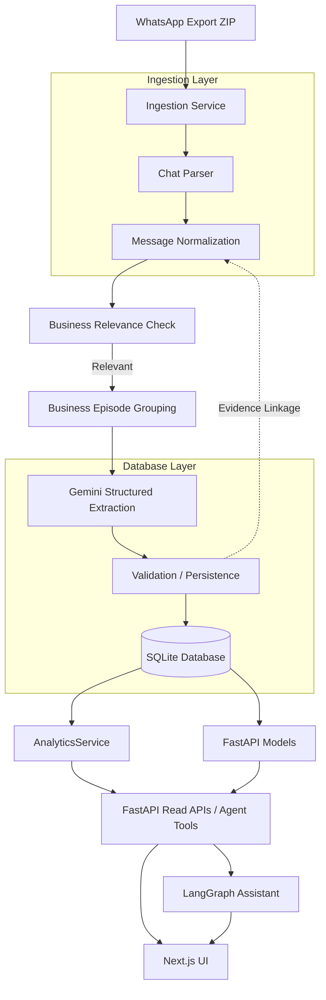

# ChatInsights MVP Architecture

This document describes the current architecture for the Blueprint BI / ChatInsights MVP, which focuses on WhatsApp ZIP extraction, AI-powered business episode extraction, and analytics viewing.

## Core Workflow Diagram

## Key Architectural Decisions

1. **WhatsApp Export Input:** Real-time API integration is not part of the MVP. Data enters the system via exported `.txt` or `.zip` formats, preserving raw history.
2. **Business Episode Grouping:** Rather than fragmenting extraction across single messages, related messages are grouped into temporal/semantic episodes. The AI extracts a consolidated view, allowing atomic replacements and minimizing duplication.
3. **Evidence Linkage:** Every extracted entity (Order, Feedback, Inquiry) retains relational links to its originating `message_ids`. This enables the UI to ground insights with real WhatsApp text.
4. **Deterministic Analytics Boundary:** Quantitative metrics (Total Orders, Revenue) are calculated deterministically via SQLAlchemy in the `AnalyticsService`. The LangGraph Agent is given tools to query these metrics rather than attempting to compute them via raw LLM summarization.
5. **AI Boundary:** Gemini 1.5 is used strictly for semantic routing (in the Assistant) and structured extraction (in the Ingestion pipeline).
